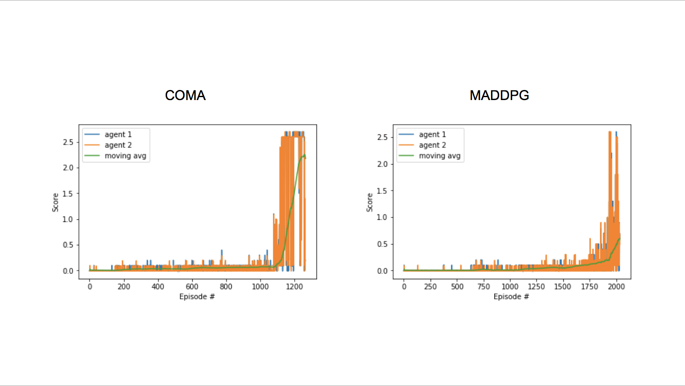
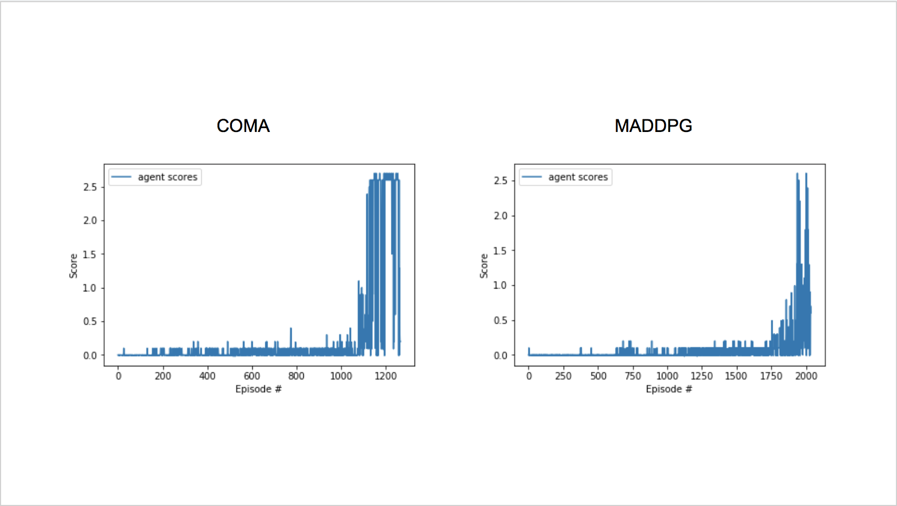
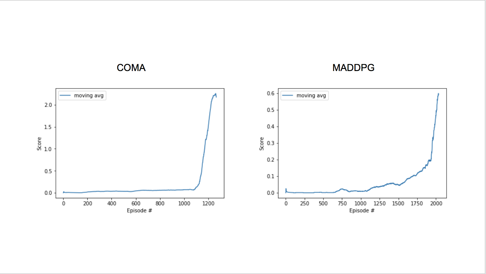

# Intro

This project looks at implementing the [Deep Deterministic Policy Gradient](https://arxiv.org/pdf/1509.02971.pdf) (DDPG) algorithm in a multi agent environment. DDPG was not designed for this type of environment and will not fit the problem straight out of the box. Luckily there has been a lot of research carried out in the area of Multi Agent Reinforcement Learning (MARL) and there are several ways to adapt the DDPG algorithm to suit this environment

The Tennis environment provided an interesting challenge and required several modifications to my original DDPG implementation. These modifications came from two papers discussed below. Using the methods describe in these paper, the agent was able to successfully learn how to co-opoerate with each other in order keep the tennis ball in play for as long as possible.

# The Environment

The environment used for this project was built using the Unity [ml-agents](https://github.com/Unity-Technologies/ml-agents) framework.

In this environment, two independent agents each control a paddle and are tasked with rallying the ball back and forth for as long as possible. A reward of +0.1 is given each time the agent hits the ball over the net. A reward of -0.1 is given to the agent each time the ball hits their side of the court.

The observation space consists of 8 variables corresponding to position and velocity of the ball and agents paddle. 

The action space consists of 2 continuous actions corresponding to movement toward net or away from net, and jumping.

# Algorithm Used - MADDPG/COMA

Initially I chose to go with Multi Agent Deep Deterministic Policy Gradient (MADDPG) algorithm as the OpenAI paper [Multi-Agent Actor-Critic for Mixed
Cooperative-Competitive Environments](https://arxiv.org/pdf/1706.02275.pdf)[5] shows that MADDPG outperforms many other RL algorithms. Here the paper looks at DQN , TRPO and DDPG. The results shows that MADDPG is able to not only converge faster, but is also more stable during training. It is worth pointing out that current state of the art algorithms such as PPO and SAC were not tested at the time of writing. Although these algorithms are capable of perform as well as, or if not better, than MADDPG, due to my past experiences with standard DDPG for similar control tasks I felt that MADDPG was a good algorithm to apply. However a key feature of MADDPG is the centralized critic networks for each agent. This is used to allow multi agents to learn from different rewards, thus allowing MADDPG to be used in environments that can only use local information, does not assume a differentiable model of the environment dynamics and most importantly, allows the agent to be trained in bot competitive and coopoerative environments. 

This is very powerful, however as the Tennis environment uses the same reward function for all agents this level of generalisation is unnecessary. As such I felt that the approach used in the paper [Counterfactual Multi-Agent Policy Gradients](https://arxiv.org/pdf/1705.08926.pdf)[4] is better suited to this problem. In this paper researchers at Oxford took a different approach to the multi agent problem and used a shared critic between the agents. This provides a counterfactual baseline that improves both the speed of training and performance of multi agents. In my experiments I implemented an MADDPG using a single shared critic in order to improve training based on this environment. 

This report will go through the methodology of my implementation, the experiments and changes I made during training, the results achieved from these experiments and finally my thoughts on future work.

## Methodology

DDPG is an off-policy, actor critic method that performs more like an advanced DQN built for continuous tasks. Although DQN has achieved superhuman performance on a number of environments such as the Atari games, it can only handle discrete and low-dimensional action spaces[1]. As such it cant handle continuous action spaces. This problem can be solved by combining the techniques used in DQN with the actor-critic methodology. This new form of algorithm is capable of tackeling a much broader range of more complicated tasks such as the control problem provided in the Tennis environment. The next key component is the modification to allow for multi agents to learn to interact in the same environment. 

### DDPG 

As stated previously it is impractical to try and map Q values to state/actions for continuous tasks as Q learning requires an optimization step at each time step. This step is simply too slow for large, unconstrained function approximators and nontrivial action spaces[1]. Instead DDPG uses the actor network to maintain the current deterministic policy using the actor function μ(s|θμ) which maps states to the best action. Just like in Q learning, the critic is learned using the Q function Q(s|a) to determine the state/action value. During this calculation the critic takes in the output of the actor as target for training, similar to the approach used in DQN.

As stated previously, DDPG builds upon much of the methodology used in DQN. As this is an off-policy method, DDPG uses experience replay to store large amounts of timesteps (s,a,r,s') and samples minibatches of these experiences in order to leanr/update the agents networks.

One problem seen in many experiments using Q learning with neural networks is that the training can be unstable. This is due to the fact that the network being updated Q(s,a|θQ) is also used in calculating the target value [1]. DQN (Mnih et al., 
) solved this using a target network, this was further improved on by using Double DQN's[3]. DDPG has a different approach to this problem using "soft" target updates instead of directly copying weights [1]. As in DQN, two networks are maintained for both the actor and critic, the local and target network. Instead of directly copying weights at regular intervals, soft updates mixes in 0.01% of the local network into the target network. This makes the network change slowly and greatly improves training stability.

The final problem associated with continuous action spaced environments is that of exploration. DQN uses an epsilon-greedy approach, that works well for discrete action spaces but is not sufficient for continuous action spaces. Instead DDPG  constructs an exploration policy μ′ by adding noise sampled from a noise process N to our actor policy[1]. The noise used here is the Ornstein-Uhlenbeck process (Uhlenbeck & Ornstein, 1930).

      μ′(st) = μ(st|θtμ) + N

### MADDPG Psuedo

As you can see from the psuedo code, MADDPG is very similar to the standard DDPG algorithm. All that is required is to manage the individual DDPG agent allowing them to act independently while using the same replay buffer to learn from. My implementation uses a master MultiAgent class that initializes all the agents and manages the main functions for training such as step, act and learn. When the act and learn functions are called, the MultiAgent iterates through all the agents and carries out the function for each agent. The step function is used to store the experiences of all agents in a shared buffer and is there fore universal. 

### MADDPG Multi Critics

The diagram above shows the architecture of the MADDPG agents. Each agent has its own actor and critic. These individual critics are assigned to their respective agents and identifies the value of their agents actions independently. This allows an agent to learn a different policy from other agents in its environment . This is very usful when you are dealing with an environment where not all agents should behave the same way. However in the tennis environment we want our agents to learn the same reward function.

### COMA Single Critic

      
The Counterfactual Multi Agent approach differs from MADDPG in its use of the critic network. Instead of using individual critics, it has a single critic that all agents feed into as seen in the diagram above. This means that all agents are being evaluated by the same critic and allows the agents to learn faster. 

## Experiments and Training

During my previous implementation of DDPG I learned a lot about the algorithm and was able to solve a lot of problems that came up during my first attempt at implementation. During this project I was able to avoid most of the problems I had seen before such as catostrophic forgetting. This project came with its own array of challenges and problems that I needed to work through.

**Model Architecture**

My previous implementation performed very well and at first I was naive enough to believe that the same network architecture and hyperparameters would work for this environment as well. Unfortunately I was mistaken. 

**Previous Network Architecture**

| Layers           |Parameters           |
|:-------------:| :-------------:| 
| Dense Layer| 1000| 
| ReLU activation| NA|   
| Dense Layer| 1000| 
| ReLU activation| NA| 
|Dense Layer|4| 

**Previous Hyperparameters**

| Parameter | Value |  
|:-------------:| :-------------:|
|Learning Rate Actor    | 0.0001   |  
|Learning Rate Critic   | 0.0001   |  
|Weight Decay | 0 |
|Batch Size    | 512     | 
|Buffer Size    | 1000000    | 
|Update Size | 10 |
| Tau | 0.001|
|Gamma| 0.99|

The agent was incredibly slow and did not show any signs of learning. Through various rounds of trial and error where I tweaked my parameters I concluded that not only was my network too wide but also too simplistic for this environment. After several experiments and tunning I discovered that my network architecture still worked well and I only needed to change up my parameters as follows:

**Hyper Parameters**

| Actor Layers           |Parameters           |
|:-------------:| :-------------:| 
| Dense Layer| 256| 
| ReLU activation| NA|   
| Dense Layer| 256| 
| ReLU activation| NA| 
|Dense Layer|2| 

| Critic Layers           |Parameters           |
|:-------------:| :-------------:| 
| Dense Layer| 128| 
| ReLU activation| NA|   
| Dense Layer| 128| 
| ReLU activation| NA| 
|Dense Layer|1| 

| Parameter | Value |  
|:-------------:| :-------------:|
|Learning Rate Actor    | 0.0001   |  
|Learning Rate Critic   | 0.0001   |  
|Weight Decay | 0 |
|Batch Size    | 64     | 
|Buffer Size    | 1000000    | 
|Update Step | 2 |
|Update Size | 1 |
| Tau | 0.001|
|Gamma| 0.99|
|Exploration Steps|50000|

# Results

I conclusion, my mutlti agent implementation DDPG was successfully able to converge on an optimal policy that was capable of reaching and maintaining an average score of 2.5 and a high score of 2.6 given the time step limit of 1000 . This required some tweaking of the update parameters and some modifications to the structure of the agents critic network that combined ideas from MADDPG and COMA. My experiments show that the model using COMA's approach of a single critic worked well in this environment. This can be seen in the plots below visualising the results of both the single and multi critic agents trained in the tennis environment.

**Overview**

**Agent Scores**

**Moving Average**

The full results and hyperparameters used are shown below. As you can see from the graph, the agent is slow to learn at first, but after ~50 episodes the learn improves drastically. As you can see from the plot below, the agent began hitting a score 39/40 after ~100 episodes and reached the competion score of 30 after ~70 episodes. Of course it took longer to get the 100 episode average to prove that the agents score was stable.

Based on this I believe that other architectures, such as the one described in the DDPG paper, may work equally well but I simply did let the agent train for long enough. Nonetheless, I am very happy with the results of my agent.

# Future Work

## D4PG
The obvious next step would be to try to implement the successor of DDPG, Distributed Distributional Deterministic Policy Gradient. This is a much more advanced algorithm and has been shown to significantly improve upon DDPG for most tasks under most conditions. 

## Crawler Environment
With the success of the agent in the reacher environment I attempted to train it on the more advanced crawler environnment. Unfortunately the crawler binary was not able to run when I began training. I am not sure why this is the case and I am waiting for a response from the Udacity team on the issue. Once I get a working copy of the binary I will begin training my DDPG agent on the crawler.

# References

[1] Timothy P Lillicrap, Jonathan J Hunt, Alexander Pritzel, Nicolas Heess, Tom Erez, Yuval Tassa, David Silver, and Daan Wierstra. Continuous control with deep reinforcement learning. In Inter- national Conference on Learning Representations, 2016.

[2] Yuval Tassa, Yotam Doron, Alistair Muldal, Tom Erez,
Yazhe Li, Diego de Las Casas, David Budden, Abbas Abdolmaleki, Josh Merel, Andrew Lefrancq, Timothy Lillicrap, Martin Riedmiller. DeepMind Control Suite. cs.AI, 2018

[3] Hado van Hasselt, Arthur Guez, David Silver. Deep Reinforcement Learning with Double Q-learning. 2016

[4] J. Foerster, G. Farquhar, T. Afouras, N. Nardelli, and S. Whiteson. Counterfactual multi-agent
policy gradients. arXiv preprint arXiv:1705.08926, 2017.

[5] R. Lowe, Y. Wu, A. Tamar, J. Harb, P, AAbbeel, I, Mordatch .Multi-Agent Actor-Critic for Mixed Cooperative-Competitive Environments. arXiv preprint arXiv:1706.02275, 2017
